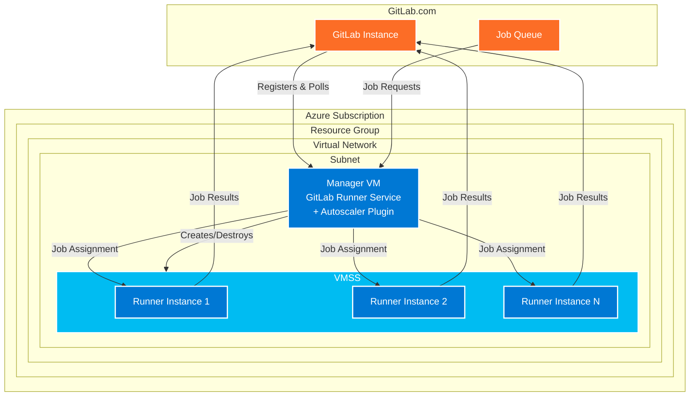

# GitLab Runner on Azure using Virtual Machine Scale Sets (VMSS)

This repository provides Infrastructure as Code (IaC) templates and scripts to deploy an auto-scaling GitLab Runner infrastructure on Azure using Virtual Machine Scale Sets (VMSS). The solution supports both Linux and Windows runners and automatically scales based on job demand.

## Overview

This solution creates a GitLab Runner infrastructure that consists of:

- **Manager VM**: A single virtual machine that runs the GitLab Runner service with the instance executor
- **Auto-scaling VMSS**: A Virtual Machine Scale Set that provides compute resources for running CI/CD jobs
- **Network Infrastructure**: Virtual network, subnet, and security configurations
- **Auto-scaling Logic**: Automatic scaling of runner instances based on job queue demand

## Architecture



### How it Works

1. **Manager VM** runs GitLab Runner with the "instance" executor and Azure autoscaler plugin
2. **Registration**: The manager registers with your GitLab instance using the provided token
3. **Job Polling**: The manager continuously polls GitLab for pending jobs
4. **Auto-scaling**: When jobs are queued, the autoscaler creates new instances in the VMSS
5. **Job Execution**: Jobs are distributed to available VMSS instances
6. **Scale Down**: After jobs complete and idle time expires, instances are automatically terminated

## Table of Contents

- [GitLab Runner on Azure using Virtual Machine Scale Sets (VMSS)](#gitlab-runner-on-azure-using-virtual-machine-scale-sets-vmss)
  - [Overview](#overview)
  - [Architecture](#architecture)
    - [How it Works](#how-it-works)
  - [Table of Contents](#table-of-contents)
  - [Prerequisites](#prerequisites)
  - [Quick Start](#quick-start)
  - [Configuration Options](#configuration-options)
  - [Network Configuration](#network-configuration)
  - [Security Considerations](#security-considerations)
  - [Monitoring and Troubleshooting](#monitoring-and-troubleshooting)
  - [Limitations](#limitations)
  - [Contributing](#contributing)

## Prerequisites

- **Azure CLI** installed and configured ([Install Guide](https://docs.microsoft.com/en-us/cli/azure/install-azure-cli))
- **Azure Developer CLI (azd)** installed ([Install Guide](https://docs.microsoft.com/en-us/azure/developer/azure-developer-cli/install-azd))
- **GitLab account** with a project where you want to register runners
- **Azure subscription** with sufficient quota for VMs
- **GitLab Runner Registration Token** (found in your GitLab project under Settings → CI/CD → Runners)
- Basic knowledge of Azure, GitLab CI/CD, and Infrastructure as Code

## Quick Start

1. **Clone this repository**:
   ```bash
   git clone https://github.com/Azure-Samples/Gitlab-Runner-VMSS.git
   cd Gitlab-Runner-VMSS
   ```

2. **Get your GitLab Runner Token**:
   - Navigate to your GitLab project
   - Go to Settings → CI/CD → Runners
   - Click "New project runner"
   - Copy the registration token

3. **Deploy the infrastructure**:
   ```bash
   azd up
   ```
   
   You'll be prompted for:
   - **Environment name**: A unique name for your deployment
   - **Azure location**: The Azure region to deploy to
   - **GitLab token**: Your runner registration token
   - **Virtual network settings**: Choose existing or create new
   - **Runner type**: Linux (default) or Windows

4. **Verify deployment**:
   - Check your GitLab project's CI/CD settings to see the registered runner
   - The runner should show as "online" and ready to accept jobs

## Configuration Options

The solution supports several configuration parameters:

| Parameter | Description | Default | Required |
|-----------|-------------|---------|----------|
| `appName` | Environment name for resource naming | - | Yes |
| `location` | Azure region for deployment | - | Yes |
| `gitlabToken` | GitLab runner registration token | - | Yes |
| `runnerType` | Runner OS type (Linux/Windows) | Linux | No |
| `vnetAddressSpace` | Virtual network CIDR block | 10.0.0.0/16 | No* |
| `subnetAddressSpace` | Subnet CIDR block | 10.0.1.0/24 | No* |
| `existingVnetId` | Existing VNet resource ID | - | No |
| `existingSubnetId` | Existing subnet resource ID | - | No |

*Required if creating a new virtual network

### Autoscaler Configuration

The autoscaler is configured with the following default settings (can be modified in `scripts/configure-manager-vm.sh`):

- **Max instances**: 10
- **Idle count**: 1 (minimum instances to keep running)
- **Idle time**: 20 minutes (time before scaling down idle instances)
- **Capacity per instance**: 1 job per VM

## Network Configuration

### New Virtual Network (Default)
- Creates a new VNet with the specified address space
- Creates a subnet for the GitLab runners
- Configures basic security groups

### Existing Virtual Network
- Uses your existing VNet and subnet
- Ensure the subnet has sufficient IP addresses
- Required outbound connectivity:
  - Port 443 (HTTPS) to GitLab.com
  - Port 22 (SSH) or 3389 (RDP) for management (optional)

## Security Considerations

> ⚠️ **Important**: The default configuration is optimized for demonstration purposes. For production use, consider these security enhancements:

- **Network Security**: 
  - Implement Network Security Groups (NSG) with restrictive rules
  - Use Azure Firewall or Application Gateway for additional protection
  - Consider private endpoints for Azure services

- **Identity and Access**:
  - Use Azure Key Vault for sensitive information
  - Implement Azure AD authentication where possible
  - Use managed identities for Azure resource access

- **Runner Security**:
  - Regularly update VM images
  - Implement proper secret management in GitLab
  - Use protected runners for sensitive workloads

- **Monitoring**:
  - Enable Azure Monitor and Log Analytics
  - Set up alerts for unusual activity
  - Monitor resource usage and costs

## Monitoring and Troubleshooting

### Common Issues

1. **Runner not appearing in GitLab**:
   - Verify the GitLab token is correct
   - Check manager VM logs: `sudo journalctl -u gitlab-runner -f`
   - Ensure network connectivity to GitLab.com

2. **Jobs stuck in pending**:
   - Check VMSS scaling limits
   - Verify VMSS instances can reach GitLab.com
   - Check manager VM autoscaler logs

3. **VMSS instances not starting**:
   - Verify Azure quotas and limits
   - Check VM size availability in the region
   - Review Azure Activity Log for deployment errors

### Logs and Monitoring

- **Manager VM logs**: `/var/log/gitlab-runner/`
- **Azure Activity Log**: Monitor resource creation and scaling events
- **VMSS diagnostics**: Enable boot diagnostics for troubleshooting

### Accessing the Manager VM

```bash
# Get the manager VM's IP address
az vm list-ip-addresses --resource-group rg-{your-env-name} --name vm-{your-env-name}

# SSH to the manager VM (Linux)
ssh azureuser@{manager-vm-ip}
```

## Limitations

- **Regional availability**: VMSS features may vary by Azure region
- **Scaling speed**: It takes 2-3 minutes to provision new VMSS instances
- **Cost**: Running instances incur costs even when idle (consider idle_count setting)
- **GitLab.com only**: Currently configured for GitLab.com (can be modified for self-hosted GitLab)
- **Single runner type**: Each deployment supports either Linux or Windows, not both

## Contributing

This project welcomes contributions and suggestions. Please see [CONTRIBUTING.md](CONTRIBUTING.md) for details on how to contribute to this project.
