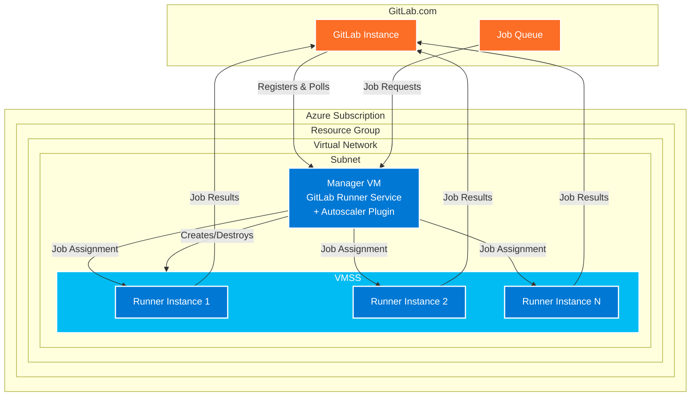

# GitLab Runner on Azure using Virtual Machine Scale Sets (VMSS)

This repository provides Infrastructure as Code (IaC) templates and scripts to deploy an auto-scaling GitLab Runner infrastructure on Azure using Virtual Machine Scale Sets (VMSS). The solution supports both Linux and Windows runners and automatically scales based on job demand.

## Overview

This solution creates a GitLab Runner infrastructure that consists of:

- **Manager VM**: A single virtual machine that runs the GitLab Runner service with the instance executor
- **Auto-scaling VMSS**: A Virtual Machine Scale Set that provides compute resources for running CI/CD jobs
- **Network Infrastructure**: Virtual network, subnet, and security configurations
- **Auto-scaling Logic**: Automatic scaling of runner instances based on job queue demand

## Architecture


```mermaid
graph TB
    subgraph "GitLab.com"
        GL[GitLab Instance]
        GLQ[Job Queue]
    end
    
    subgraph "Azure Subscription"
        subgraph "Resource Group"
            subgraph "Virtual Network"
                subgraph "Subnet"
                    MGR[Manager VM<br/>GitLab Runner Service<br/>+ Autoscaler Plugin]
                    
                    subgraph "VMSS"
                        VM1[Runner Instance 1]
                        VM2[Runner Instance 2]
                        VM3[Runner Instance N]
                    end
                end
            end
        end
    end
    
    GL -->|Registers & Polls| MGR
    GLQ -->|Job Requests| MGR
    MGR -->|Creates/Destroys| VMSS
    MGR -->|Job Assignment| VM1
    MGR -->|Job Assignment| VM2
    MGR -->|Job Assignment| VM3
    
    VM1 -->|Job Results| GL
    VM2 -->|Job Results| GL
    VM3 -->|Job Results| GL

    classDef azure fill:#0078d4,stroke:#fff,stroke-width:2px,color:#fff
    classDef gitlab fill:#fc6d26,stroke:#fff,stroke-width:2px,color:#fff
    classDef vmss fill:#00bcf2,stroke:#fff,stroke-width:2px,color:#fff
    
    class GL,GLQ gitlab
    class MGR,VM1,VM2,VM3 azure
    class VMSS vmss
```

### How it Works

1. **Manager VM** runs GitLab Runner with the "instance" executor and Azure autoscaler plugin
2. **Registration**: The manager registers with your GitLab instance using the provided token
3. **Job Polling**: The manager continuously polls GitLab for pending jobs
4. **Auto-scaling**: When jobs are queued, the autoscaler creates new instances in the VMSS
5. **Job Execution**: Jobs are distributed to available VMSS instances
6. **Scale Down**: After jobs complete and idle time expires, instances are automatically terminated

## Table of Contents

- [GitLab Runner on Azure using Virtual Machine Scale Sets (VMSS)](#gitlab-runner-on-azure-using-virtual-machine-scale-sets-vmss)
  - [Overview](#overview)
  - [Architecture](#architecture)
    - [How it Works](#how-it-works)
  - [Table of Contents](#table-of-contents)
  - [Prerequisites](#prerequisites)
  - [Quick Start](#quick-start)
  - [Configuration Options](#configuration-options)
  - [Network Configuration](#network-configuration)
  - [Security Considerations](#security-considerations)
  - [Monitoring and Troubleshooting](#monitoring-and-troubleshooting)
  - [Limitations](#limitations)
  - [Contributing](#contributing)

## Prerequisites

- **Azure CLI** installed and configured ([Install Guide](https://docs.microsoft.com/en-us/cli/azure/install-azure-cli))
- **Azure Developer CLI (azd)** installed ([Install Guide](https://docs.microsoft.com/en-us/azure/developer/azure-developer-cli/install-azd))
- **GitLab account** with a project where you want to register runners
- **Azure subscription** with sufficient quota for VMs
- **GitLab Runner Registration Token** (found in your GitLab project under Settings → CI/CD → Runners)
- Basic knowledge of Azure, GitLab CI/CD, and Infrastructure as Code

## Quick Start

Follow these steps to deploy your GitLab Runner infrastructure on Azure:

### Step 1: Clone the Repository

```bash
git clone https://github.com/Azure-Samples/Gitlab-Runner-VMSS.git
cd Gitlab-Runner-VMSS
```

### Step 2: Obtain Your GitLab Runner Registration Token

Before deploying, you need a runner registration token from GitLab:

1. **Navigate to your GitLab project** (e.g., `https://gitlab.com/your-username/your-project`)
2. **Go to Settings → CI/CD**
3. **Expand the "Runners" section**
4. **Click "New project runner"** button
5. **Configure runner settings**:
   - Select Linux or Windows as the operating system
   - Add optional tags if needed (e.g., `azure`, `vmss`)
   - Check "Run untagged jobs" if you want this runner to pick up all jobs
6. **Click "Create runner"**
7. **Copy the registration token** displayed (starts with `glrt-`) - you'll need this in the next step

> 💡 **Tip**: Keep this token secure. You can regenerate it later if needed from the same CI/CD settings page.

### Step 3: Login to Azure

Ensure you're logged into Azure CLI and have the correct subscription selected:

```bash
# Login to Azure (if not already logged in)
az login

# List your subscriptions
az account list --output table

# Set the subscription you want to use
az account set --subscription "Your-Subscription-Name-or-ID"

# Verify the correct subscription is selected
az account show --output table
```

### Step 4: Deploy the Infrastructure

Run the Azure Developer CLI deployment command:

```bash
azd up
```

The deployment process will prompt you for the following information:

1. **Environment name**: 
   - Enter a unique name for your deployment (e.g., `gitlab-prod`, `my-runners`)
   - This will be used to name your Azure resources
   - Use lowercase letters, numbers, and hyphens only

2. **Azure location**: 
   - Choose an Azure region (e.g., `eastus`, `westeurope`, `southeastasia`)
   - Select a region close to your users for better performance
   - Check [Azure Products by Region](https://azure.microsoft.com/en-us/explore/global-infrastructure/products-by-region/) for availability

3. **GitLab token**: 
   - Paste the registration token you obtained in Step 2
   - The token will be stored securely in Azure Key Vault

4. **Runner type**:
   - Choose `linux` (default) or `windows`
   - Must match the OS you selected when creating the runner in GitLab

5. **Virtual network configuration**:
   - **Option A - Create new** (recommended for new deployments):
     - Provide a VNet address space (default: `10.0.0.0/16`)
     - Provide a subnet address space (default: `10.0.1.0/24`)
   - **Option B - Use existing**:
     - Provide your existing VNet resource ID
     - Provide your existing subnet resource ID
     - Ensure the subnet has adequate IP address space and network connectivity

**What happens during deployment:**
- Creates an Azure Resource Group
- Deploys a Virtual Network (if creating new)
- Creates a Manager VM with GitLab Runner installed
- Creates a Virtual Machine Scale Set (VMSS) for runner instances
- Configures auto-scaling policies
- Registers the runner with your GitLab instance

**Deployment time:** Expect the deployment to take 5-10 minutes.

### Step 5: Verify the Deployment

After deployment completes, verify everything is working correctly:

1. **Check the deployment output**:
   ```bash
   azd show
   ```
   This displays your deployment details and resource information.

2. **Verify in GitLab**:
   - Return to your GitLab project
   - Go to **Settings → CI/CD → Runners**
   - You should see your new runner listed with a green "online" indicator
   - The runner description will show `azure-vmss-runner-{environment-name}`

3. **Test the runner** (optional):
   - Create a simple `.gitlab-ci.yml` file in your project:
     ```yaml
     test-runner:
       script:
         - echo "Hello from Azure VMSS runner!"
         - uname -a
     ```
   - Commit and push the file
   - Go to **CI/CD → Pipelines** to see your job running on the new runner

### Step 6: Monitor Your Infrastructure

Access the Azure Portal to monitor your deployment:

```bash
# Open your resource group in the Azure Portal
az group show --name rg-{your-environment-name} --query id -o tsv | xargs -I {} open "https://portal.azure.com/#@/resource{}"
```

Or manually navigate to [portal.azure.com](https://portal.azure.com) and find your resource group named `rg-{your-environment-name}`.

**What to check:**
- ✅ Manager VM is running
- ✅ VMSS is created (may show 0 instances until jobs are queued)
- ✅ Network security groups are configured
- ✅ No deployment errors in the Activity Log

### Troubleshooting Startup Issues

If the runner doesn't appear online in GitLab:

1. **Verify the GitLab token** is correct:
   ```bash
   # SSH to the manager VM (get IP from Azure Portal)
   ssh azureuser@{manager-vm-ip}
   
   # Check GitLab Runner status
   sudo gitlab-runner verify
   sudo systemctl status gitlab-runner
   ```

2. **Check manager VM logs**:
   ```bash
   sudo journalctl -u gitlab-runner -f
   ```

3. **Verify network connectivity**:
   ```bash
   curl -I https://gitlab.com
   ```

4. **Check Azure deployment logs**:
   - Go to your resource group in Azure Portal
   - Click on "Deployments" in the left menu
   - Review any failed deployments

For more detailed troubleshooting, see the [Monitoring and Troubleshooting](#monitoring-and-troubleshooting) section below.

## Configuration Options

The solution supports several configuration parameters:

| Parameter | Description | Default | Required |
|-----------|-------------|---------|----------|
| `appName` | Environment name for resource naming | - | Yes |
| `location` | Azure region for deployment | - | Yes |
| `gitlabToken` | GitLab runner registration token | - | Yes |
| `runnerType` | Runner OS type (Linux/Windows) | Linux | No |
| `vnetAddressSpace` | Virtual network CIDR block | 10.0.0.0/16 | No* |
| `subnetAddressSpace` | Subnet CIDR block | 10.0.1.0/24 | No* |
| `existingVnetId` | Existing VNet resource ID | - | No |
| `existingSubnetId` | Existing subnet resource ID | - | No |

*Required if creating a new virtual network

### Autoscaler Configuration

The autoscaler is configured with the following default settings (can be modified in `scripts/configure-manager-vm.sh`):

- **Max instances**: 10
- **Idle count**: 1 (minimum instances to keep running)
- **Idle time**: 20 minutes (time before scaling down idle instances)
- **Capacity per instance**: 1 job per VM

## Network Configuration

### New Virtual Network (Default)
- Creates a new VNet with the specified address space
- Creates a subnet for the GitLab runners
- Configures basic security groups

### Existing Virtual Network
- Uses your existing VNet and subnet
- Ensure the subnet has sufficient IP addresses
- Required outbound connectivity:
  - Port 443 (HTTPS) to GitLab.com
  - Port 22 (SSH) or 3389 (RDP) for management (optional)

## Security Considerations

> ⚠️ **Important**: The default configuration is optimized for demonstration purposes. For production use, consider these security enhancements:

- **Network Security**: 
  - Implement Network Security Groups (NSG) with restrictive rules
  - Use Azure Firewall or Application Gateway for additional protection
  - Consider private endpoints for Azure services

- **Identity and Access**:
  - Use Azure Key Vault for sensitive information
  - Implement Azure AD authentication where possible
  - Use managed identities for Azure resource access

- **Runner Security**:
  - Regularly update VM images
  - Implement proper secret management in GitLab
  - Use protected runners for sensitive workloads

- **Monitoring**:
  - Enable Azure Monitor and Log Analytics
  - Set up alerts for unusual activity
  - Monitor resource usage and costs

## Monitoring and Troubleshooting

### Common Issues

1. **Runner not appearing in GitLab**:
   - Verify the GitLab token is correct
   - Check manager VM logs: `sudo journalctl -u gitlab-runner -f`
   - Ensure network connectivity to GitLab.com

2. **Jobs stuck in pending**:
   - Check VMSS scaling limits
   - Verify VMSS instances can reach GitLab.com
   - Check manager VM autoscaler logs

3. **VMSS instances not starting**:
   - Verify Azure quotas and limits
   - Check VM size availability in the region
   - Review Azure Activity Log for deployment errors

### Logs and Monitoring

- **Manager VM logs**: `/var/log/gitlab-runner/`
- **Azure Activity Log**: Monitor resource creation and scaling events
- **VMSS diagnostics**: Enable boot diagnostics for troubleshooting

### Accessing the Manager VM

```bash
# Get the manager VM's IP address
az vm list-ip-addresses --resource-group rg-{your-env-name} --name vm-{your-env-name}

# SSH to the manager VM (Linux)
ssh azureuser@{manager-vm-ip}
```

## Limitations

- **Regional availability**: VMSS features may vary by Azure region
- **Scaling speed**: It takes 2-3 minutes to provision new VMSS instances
- **Cost**: Running instances incur costs even when idle (consider idle_count setting)
- **GitLab.com only**: Currently configured for GitLab.com (can be modified for self-hosted GitLab)
- **Single runner type**: Each deployment supports either Linux or Windows, not both

## Contributing

This project welcomes contributions and suggestions. Please see [CONTRIBUTING.md](CONTRIBUTING.md) for details on how to contribute to this project.
